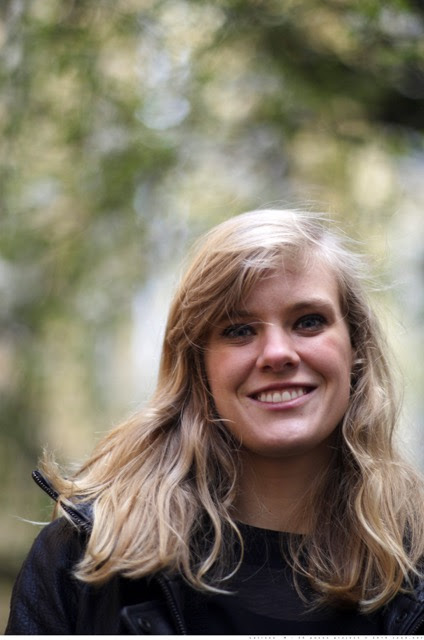

# Larissa Richards

<figure><figcaption></figcaption></figure>

## About

I am an EPSRC Research Fellow at the University of Leeds and I work with Amanda Turner. Previously, I was a postdoc at the Mathematical Sciences Research Institute (MSRI) in Berkeley, CA within the scientific program [The Analysis and Geometry of Random Spaces ](https://www.msri.org/programs/317)and even before I was a postdoc at Lancaster University. I received my PhD at the University of Toronto under the supervision of Ilia Binder.

My research interests lie in the intersection of Mathematical Physics, Geometric Function Theory, Complex Analysis, and Probability. In particular, my major research interest is Schramm Loewner Evolution (SLE). Therefore, I enjoy studying physical phenomena such as percolation, the Ising model, loop erased random walk and the Potts model especially after attending University of Geneva between 2015 and 2016 for the Master Class in Planar Statistical Physics.
